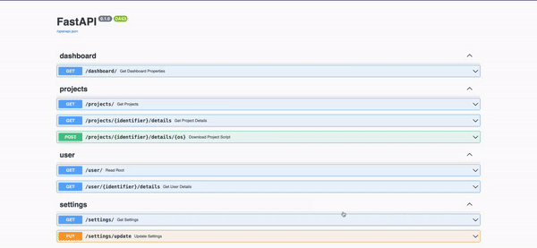

# UoW Backend App

This project provides a way to download installation scripts for your projects. This will create a shell script (`.sh`) or a configuration file ([`.config`](https://docs.chocolatey.org/en-us/choco/commands/install#packages.config)) to be run on your machine.
This application provides a simplified and abstracted RESTful API that can be easily consumed by the [UoW Frontend App](https://dev.azure.com/k-space/uow/_git/uow-frontend-app)[^1].



> [!NOTE]
>
> This repository was created within Azure DevOps and is now being mirrored to this GitHub [repository](https://github.com/kwame-mintah/python-fastapi-create-installation-scripts).
> Source of truth will always be the Azure DevOps [repository](https://dev.azure.com/k-space/uow/_git/uow-backend-app). Furthermore, this repository is
> a proof of concept for creating various scripts for MacOS / WinOS and has not been fully implemented so YMMV.

## Roadmap

More work needs to be completed for the final version of the application. Below are additional things required for a
clearer vision of what is envisioned of this application.

### Implement Authentication

Require all API requests to be authenticated via Azure Active Directory (AAD). There is various libraries that offer the
capability of configuring authentication for AAD. The chosen library, should allow for setting required `scopes` to access
an endpoint e.g. `scopes=['user']`, if the user does not have this scope a HTTP status of 403 Forbidden will be returned.

### Script(s) to uninstall / remove packages

In the same way a user is able to request a script to be generated, containing all their packages needed for a project,
another should be provided to remove and uninstall everything. Allowing for fresh installs on new projects etc.

## Getting Started

### Project structure

```markdown
.
├── app                  # "app" is a Python package
│   ├── __init__.py      # this file makes "app" a "Python package"
│   ├── main.py          # "main" module, e.g. import app.main
│   └── routers          # "routers" is a "Python subpackage"
│      ├── __init__.py  # makes "routers" a "Python subpackage"
│      └── dashboard.py     # "dashboard" submodule, e.g. import app.routers.dashboard
│      └── notifications.py    # "notifications" submodule, e.g. import app.routers.notifications
│      └── projects.py     # "projects" submodule, e.g. import app.routers.projects
│      └── setting.py     # "setting" submodule, e.g. import app.routers.setting
│      └── user.py     # "user" submodule, e.g. import app.routers.user
```

### Usage

1. Install python packages used for the service
    ```console
   pip install -r requirements.txt
    ```
2. Run the FastAPI server, which will run on port 8000
    ```console
   python app/main.py
    ```
   Endpoint documentation are available on http://127.0.0.1:8000/docs

### Tests

Unit tests are located in `/tests` directory.

## Deploy on Azure Web App

The easiest way to deploy the Next.js app is to use the [Azure Web App](https://azure.microsoft.com/en-gb/products/app-service/web/), this project has been configured to
automatically deploy changes made to the `master` branch to an environment variable, see `/azure-pipeline/azure-pipelines.yml` the following variables are required to be set.

### Pipeline variables

| Variable             | Description                                               | Default value                                               | Required? |
|----------------------|-----------------------------------------------------------|-------------------------------------------------------------|-----------|
| azureSubscription    | The Azure Subscription that contains the Azure Web App    | N/A                                                         | Yes       |
| projectPoolName      | The azure agent pool that the job will run on             | N/A                                                         | Yes       |
| pythonStartUpCommand | The start-up command to start the next.js web application | gunicorn -w 4 -k uvicorn.workers.UvicornWorker app.main:app | No        |
| webAppName           | The name of the created Azure Web App                     | N/A                                                         | Yes       |

Checkout [Deploy to App Service using Azure Pipelines](https://learn.microsoft.com/en-us/azure/app-service/deploy-azure-pipelines?tabs=yaml) for more details.

[^1]: My Azure DevOps organisation / project is private, NextJS repository is mirrored [here](https://github.com/kwame-mintah/nextjs-project-installation-dashboard) in GitHub.
